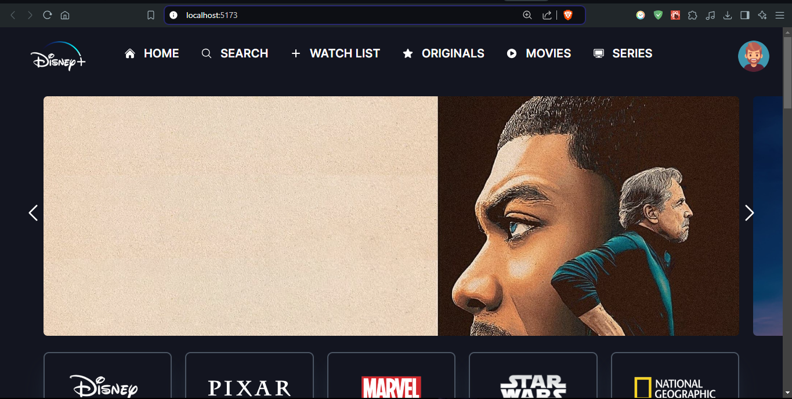

# Disney Clone Project

This project is a Disney Clone, aiming to replicate the Disney+ streaming platform. It is built using React and utilizes various libraries and APIs to fetch and display movie data.

## Project Structure

The project consists of several components and files organized in a structured manner. Here is an overview of the main files and directories:

- `src/`: This directory contains the source code of the project.
  - `components/`: This directory contains reusable React components used throughout the project.
    - `Header.jsx`: The header component displaying the navigation menu.
    - `Slider.jsx`: The slider component for showcasing trending movies.
    - `ProductionHouse.jsx`: The component displaying production house information.
    - `MovieCard.jsx`: The component for rendering individual movie cards.
    - `GenreMovieList.jsx`: The component for displaying movie lists based on genres.
    - `HrMovieCard.jsx`: The component for rendering horizontal movie cards.
    - `HeaderItem.jsx`: The component for rendering individual items in the header.
  - `Constant/`: This directory contains constant files used in the project.
    - `GenresList.js`: The file containing a list of movie genres.
  - `App.jsx`: The main entry point of the application.
  - `index.jsx`: The file responsible for rendering the application into the DOM.
- `public/`: This directory contains static assets used in the project.
- `vite.config.js`: The configuration file for the Vite build tool.

## Dependencies

The project relies on the following dependencies:

- `react`: The JavaScript library for building user interfaces.
- `react-dom`: The package for rendering React components into the DOM.
- `react-icons`: A library providing a collection of icons for React applications.
- `axios`: A library for making HTTP requests.
- `tailwindcss-no-scrollbar`: A plugin for Tailwind CSS to remove scrollbars.
- `@vitejs/plugin-react`: The Vite plugin for React integration.

## Scripts

The project includes several scripts defined in the `package.json` file:

- `dev`: Starts the development server using Vite.
- `build`: Builds the project for production.
- `preview`: Serves the production build for previewing.

## Getting Started

To run the project locally, follow these steps:

1. Clone the repository to your local machine.
2. Navigate to the project directory.
3. Install the dependencies by running `npm install`.
4. Start the development server by running `npm run dev`.
5. Open your browser and visit `http://localhost:3000` to view the application.

## Conclusion

The Disney Clone project is a React-based application that replicates the Disney+ streaming platform. It provides features such as a header with navigation, a slider for trending movies, movie lists based on genres, and production house information. By following the provided instructions, you can easily run the project locally and explore its functionalities.
